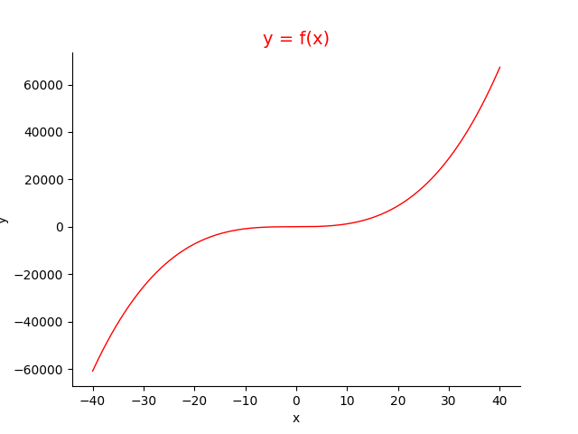
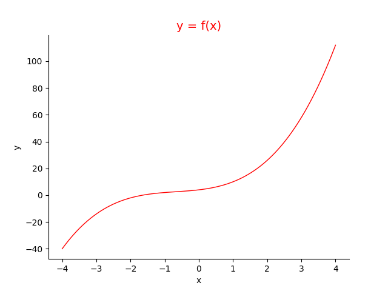
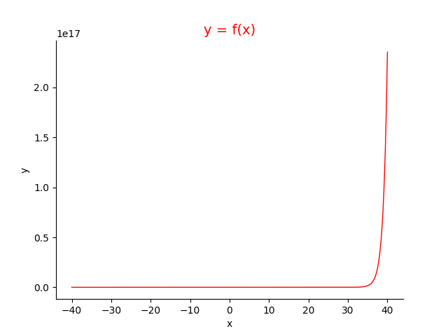
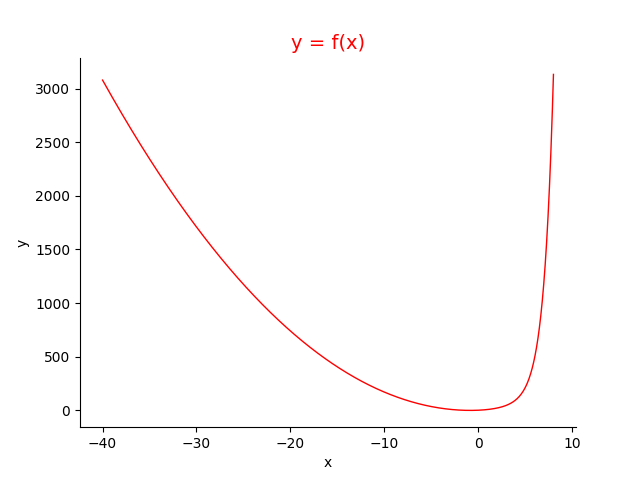

## Newton_Optimizing

牛顿最优化方法的模拟实验

### 理论
原本应用于非线性方程组求根，通常也就是高阶方程组，和转化为求f(x)=0的根，有定理证明当阶数大于5时无解析解，因此通过优化方法求之。通过泰勒展开，可得x的更新公式。

同时，类似地可在最优化任务中对f(x)'=0求得函数极值的必要条件，此时转化为求方程的根，可用牛顿法进行迭代。具体可参考：

- [https://blog.csdn.net/wangyangzhizhou/article/details/78547539](https://blog.csdn.net/wangyangzhizhou/article/details/78547539)
- [https://blog.csdn.net/HouDouZhou/article/details/85988847](https://blog.csdn.net/HouDouZhou/article/details/85988847)

### 求解实现 & 函数图像

#### 函数1：

$$ h(x) = x^3 + 2x^2 + 3x + 4 $$

其图像为



通过设置newton_opt第34、35行切换求函数f(x)=0或求极值。

求方程h(x)=0根如下：

```
$ python newton_opt.py 
-30    -25286
-20.21060782036392	-7495.094551848199
-13.679296857859505	-2222.504854689741
-9.318471145785075	-659.4468379586183
-6.403503340271682	-195.7755261078027
-4.4535586164317795	-58.02500976111885
-3.155120644286551	-16.964341074351843
-2.3171219895786916	-4.654011155134635
-1.844089679636953	-1.0020699970092979
-1.672079439497245	-0.09942173352993144
-1.6509224184141613	-0.0013406569159322146
-1.6506292469528059	-2.537636882848915e-07
-1.6506291914393902	-9.769962616701378e-15
-1.650629191439388	8.881784197001252e-16
-1.6506291914393882	0.0
-1.6506291914393882	0.0
-1.6506291914393882	0.0
-1.6506291914393882	0.0
-1.6506291914393882	0.0
====================
k =  20
x =  -1.6506291914393882
y =  0.0
```
极小值局部为



求h(x)极值如下：

```
$ python newton_opt.py 
-30	-25286
-15.323863636363637	-3170.6918657332953
-7.976313521244229	-400.15143375759624
 ...
-1.6604093722830884	-0.0449905831532833
-0.884011159848299	2.2200847148062484
0.5027140694129456	6.140631700721466
====================
k =  200
x =  -0.3195189305578747
y =  -0.027873648479056712
```
迭代始终未收敛，看函数图像发现不存在极值

#### 函数2：

$$ hh(x) = exp(x) + 2x^2 + 3x $$

其图像为




通过设置newton_opt第34、35行切换求函数f(x)=0或求极值。

求方程h(x)=0根如下：

```
$ python newton_opt.py 
-30	1710.0
-15.384615384615373	427.2189351194734
-8.086525796824102	106.52452919169572
-4.456549942843035	26.363627280573084
-2.6769789911221205	6.3702666616896515
-1.843081172002318	1.4229817325745815
-1.5054012638233905	0.23819036296712603
-1.4203234575847048	0.015302920884846749
-1.4140508894711645	8.345377071172777e-05
-1.4140163050800134	2.53757903578844e-09
-1.4140163040283418	0.0
-1.4140163040283418	0.0
-1.4140163040283418	0.0
-1.4140163040283418	0.0
-1.4140163040283418	0.0
-1.4140163040283418	0.0
-1.4140163040283418	0.0
-1.4140163040283418	0.0
-1.4140163040283418	0.0
====================
k =  20
x =  -1.4140163040283418
y =  0.0
```

极小值局部为



求h(x)极值如下：

```
$ python newton_opt.py 
-30	1710.0
-0.750000000000707	-0.6526334472593192
-0.8556189261704292	-0.6776692312440122
-0.8561939176761508	-0.6776699627469911
-0.8561939335516644	-0.6776699627469913
-0.8561939335516644	-0.6776699627469913
-0.8561939335516644	-0.6776699627469913
-0.8561939335516644	-0.6776699627469913
-0.8561939335516644	-0.6776699627469913
====================
k =  10
x =  -0.8561939335516644
y =  -0.6776699627469913
```

可以看出函数极值收敛非常快，仔细分析可发现h(x)的极值取在x=-0.85左右，在此区域内函数受exp(x)影响甚微，与$X^2$近似，也就是达到了近似二阶函数的收敛性能。

### 存在的问题：
1. 发现函数2的根应该为2个但经过若干次尝试却始终只收敛到左边的一个；
2. 函数2的图像类似hh(x)->0当x->-∞时，但其实放大后发现函数左右两侧均为无穷大，但在指数的影响下，2阶多项式变化就显得微乎其微了。
